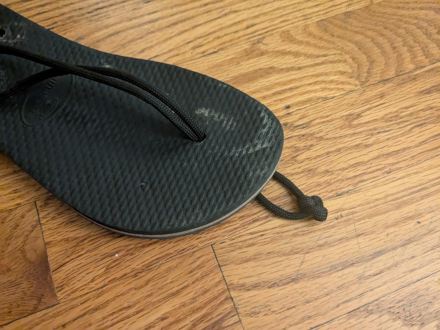

# Slipper Repair

Havaianas slippers are my favorite slippers. But their straps break far before
they are fully worn out. Here's my method for creating new straps with some
paracord.

## Step 1

Create a square knot in the middle of the string.

## Step 2

Thread through the top hole.

## Step 3

Use a [two-strand rope twist](https://bkeithropemaker.com/Rope_Chapt_4.html)
followed by a square knot at the top to form the toe hold. (Do about 5 crossings
of the two strings).

## Step 4

Tie knots at the end of the bottom holes, with a
[double overhand knot](https://www.animatedknots.com/double-overhand-stopper-knot).

Here's a good gauge of how much slack you'll want. (This is probably a little
too much, I had to tighten it by a little bit)

## Step 5

Cut / burn ends

## Final Product

